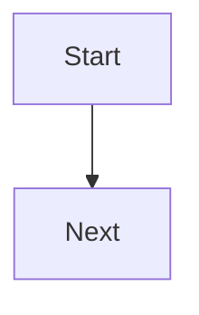

# Lesson title

**Subject:**  
**Lesson:** 1 of N

## Goal

By the end, the student can:

-

## Teach

(Simple explanation. One idea.)

## Example

(One worked example.)

## Check

Questions to ask the student (or to quiz yourself). Cover answers until they try.

1.
2.

## Student tries

-

## Media

| Kind | Status | Where |
|---|---|---|
| Watch (video) | missing | URL or `video.mp4` in this subject folder |
| Listen (audio) | missing | URL or `audio.mp3` in this subject folder |
| Image | missing | `images/name.png` — add source URL here |
| Diagram | missing | Mermaid below, or picture in `images/` |

