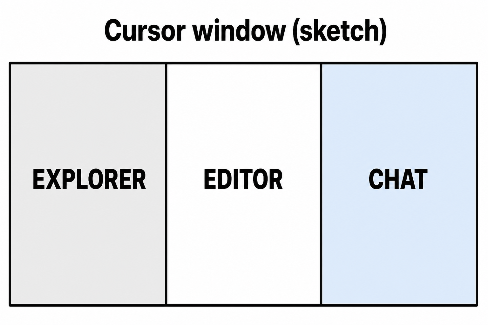
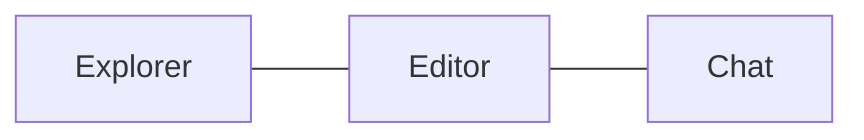

# Lesson 01: Chat vs the rest of the window

## Learning objectives

By the end of this lesson you should be able to:

- Identify the Explorer, the editor, and the chat in the Cursor window
- Explain that lessons in this book are files in a folder, not a website
- Decide when to type in chat versus when to type in a lesson file

## Prerequisites

None. You already have this book open in Cursor.

## Key terms

- **IDE** — the app that holds your files, the place you type, and (in Cursor) the chat, all in one window
- **Explorer** — the file list, usually on the left
- **Editor** — the big middle area where an open file is shown
- **Agent chat** — the panel where you talk to the agent

## Explanation

Think of Cursor as a desk with three parts: a drawer of papers (files), the paper you are reading (the open file), and a person sitting next to you that you can ask questions (chat). The “book” is just the folder of markdown files on disk.

### Cursor is the app; this book is the folder

Cursor is the program. This study notebook is a folder of `.md` files. Studying here means opening those files and talking about them — there is no separate tutoring website.

### Explorer, editor, chat

- **Explorer (left):** folders such as `subjects/cursor/`. Click a file name to open it.
- **Editor (middle):** the lesson you opened, for example this file. This is where the text of the lesson lives.
- **Chat (side panel):** where you type to the agent. The agent can read files you point it at and answer or edit.

If the chat is closed, open it from Cursor’s chat / Agent UI. The three parts stay the same idea even if you rearrange the layout.

### When to type where

- Type **in the editor** when you are taking notes, fixing a sentence, or checking a box that belongs in the lesson.
- Type **in chat** when you want a question answered, a quiz, or the agent to change files for you.

Opening `lesson-01.md` lets you read. `@`-mentioning that same file in chat (covered in a later lesson) tells the agent “use this lesson.” Either way, the lesson is still a file.

## Media

- 🎥 Video: missing
- 🔊 Audio: missing
- 🖼️ Image: generated labeled diagram, not a Cursor screenshot

  

- 📊 Diagram:

## Worked example

1. In Explorer, open `subjects/cursor/lesson-01.md` so this lesson is in the editor.
2. Find a heading, for example **When to type where**.
3. Open chat and ask: `What does the heading "When to type where" in this lesson tell me to do?`
4. Check the agent’s answer against the heading in the editor. If they disagree, the editor is the lesson text; chat is a conversation about it.

You did not leave Cursor or open a website. You used a file plus chat.

## Practice questions

1. Name the three main parts of the Cursor window this lesson cares about.

Answer
Explorer (file list), editor (open file), and Agent chat.

2. Is this tutoring book a website, or something else?

Answer
Something else: a folder of markdown files you open in Cursor.

3. You want to rewrite a sentence in this lesson yourself. Where do you type?

Answer
In the editor, in the lesson file. Chat is for asking the agent, not for storing the lesson text.

4. You want the agent to quiz you. Where do you type the request?

Answer
In Agent chat. The lesson file stays the source of what to quiz on.

5. You click `lesson-01.md` in Explorer. What should you see in the middle of the window?

Answer
The contents of this lesson in the editor.

## Quick quiz

Ask the agent: `Quiz me on lesson-01.` (5 short questions, mixed recall + application)

## Summary

Cursor is one window: files on the side, the open lesson in the middle, chat for the agent. This book is those files, not a site. Read and edit in the editor; ask and quiz in chat.

## Next

→ [Lesson 02](lesson-02.md) (Ask, Agent, and Plan)
