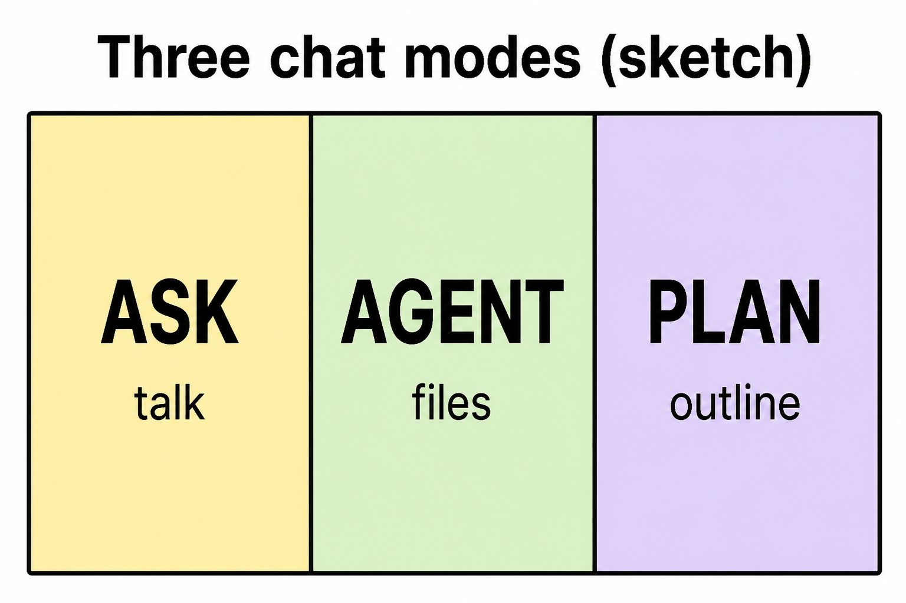
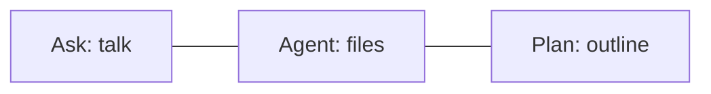

# Lesson 02: Ask, Agent, and Plan

## Learning objectives

By the end of this lesson you should be able to:

- Identify Ask, Agent, and Plan as three ways to talk to Cursor
- Explain what each mode is for in plain language
- Choose a mode for a simple study or book-building task

## Prerequisites

[Lesson 01](lesson-01.md): Explorer, editor, and [Agent chat](lesson-01.md). You type requests in chat; the lesson text lives in files.

## Key terms

- **Ask** — chat that answers questions; it should not rewrite your book files
- **Agent** — chat that can create and edit files when you ask it to
- **Plan** — chat that designs the steps first, then you confirm before (or instead of) doing the work

## Explanation

Same desk as lesson 01, but now the person next to you can work in three styles: answer only, do the work, or sketch a plan. You pick the style in the chat UI (mode names may appear as Ask / Agent / Plan).

### Ask: “Explain this; don’t change my files”

Use Ask when you want understanding. Example: “What does Explorer mean in lesson 01?” The reply stays in chat. Your `lesson-01.md` file should stay as it was.

If you only wanted a quiz explained, Ask is enough. You do not need the agent to write a new lesson for that.

### Agent: “Do it in the book”

Use Agent when the result should be a file change: add a lesson, fix a sentence, update `index.md`. Example: “Add lesson 02 to the Cursor subject.” That is this book’s job for Agent.

Agent still uses chat, but the outcome is in the folder, not only in the conversation.

### Plan: “Show the steps before changing much”

Use Plan when the task is big or unclear: several lessons, a new subject, a rewrite. The agent outlines what it would do. You say yes, change the outline, or stop.

For one small quiz question, Plan is extra. For “build five lessons on X,” Plan (or a short check-in in Agent) keeps you from getting a pile of files you did not want yet.

### A simple chooser

| You want… | Mode |
|-----------|------|
| An explanation or a quiz, files unchanged | Ask |
| A new or edited lesson / index row | Agent |
| A multi-step job you want to see first | Plan |

If you pick the “wrong” mode, switch and ask again. The files in Explorer are still the book; chat is still the conversation.

## Media

- 🎥 Video: missing
- 🔊 Audio: missing
- 🖼️ Image: generated labeled diagram, not a Cursor screenshot

  

- 📊 Diagram:

## Worked example

You finished lesson 01 and want the next lesson written.

1. Open chat. This is a **file change**, so choose **Agent** (not Ask).
2. Type: `Add the next Cursor lesson.`
3. After it writes `lesson-02.md`, open that file in the editor and skim the headings.
4. If you had been unsure what “next lesson” meant, **Plan** first: `Plan the next Cursor lesson only; don’t write it yet.` Then confirm, then Agent.

If you had typed the same request in **Ask**, you might get a description of lesson 02 with **no new file**. Check Explorer: if `lesson-02.md` is missing, you used a mode that does not write, or the write did not happen.

## Practice questions

1. Which mode is for answers without changing book files?

Answer
Ask.

2. You want a new `lesson-03.md` created. Which mode?

Answer
Agent — the result should be a file in the folder.

3. You want five new subjects sketched before any folders are created. Which mode fits best?

Answer
Plan — see the steps (and change them) before the work lands as files.

4. You are confused by a heading in [lesson 01](lesson-01.md) and only want it explained. Ask or Agent?

Answer
Ask. You are not asking anyone to edit the lesson.

5. After Agent writes a file, where do you confirm the real lesson text?

Answer
In the editor, by opening the file (Explorer). Chat can be wrong or out of date; the file is the book.

## Quick quiz

Ask the agent: `Quiz me on lesson-02.` (5 short questions, mixed recall + application)

## Summary

Ask explains and leaves files alone. Agent changes the book when you ask. Plan shows the steps first. Pick by whether you want a reply, a file change, or an outline; then check Explorer to see what actually landed.

## Next

→ [Lesson 03](lesson-03.md) (`@` files and what the agent can see)
