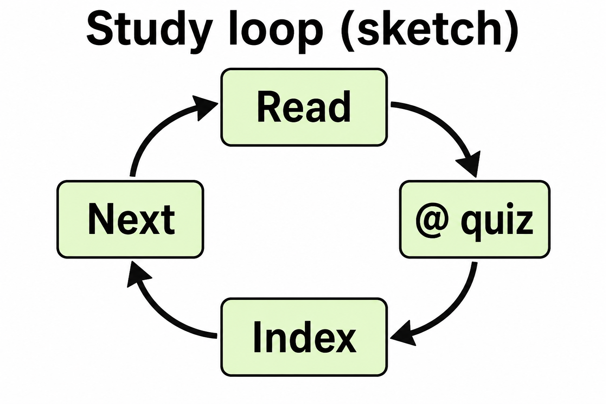
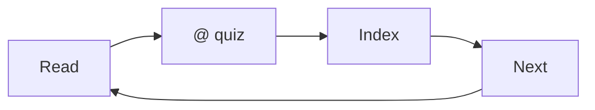

# Lesson 05: A full study loop in this book

## Learning objectives

By the end of this lesson you should be able to:

- Run one study session from open → `@` → quiz → check index
- Decide Ask vs Agent vs Plan for the next action after a session
- Name what to do when you are stuck or a file is missing

## Prerequisites

[Lessons 01–04](lesson-01.md): window, modes, [`@`](lesson-03.md), [quiz and ASK.md](lesson-04.md).

## Key terms

- **Study loop** — the repeatable sequence: pick a lesson, read it, quiz, update progress, choose next
- **Stuck** — you cannot answer, the agent and the file disagree, or the next file is not there yet

## Explanation

Put the earlier lessons in one sitting. You are not learning a fifth product feature. You are practicing the same desk: files, chat, `@`, prompts.

### The loop (one lesson)

1. In [Explorer](lesson-01.md), open the lesson file. Read objectives and explanation in the [editor](lesson-01.md).
2. Switch to chat. Use [Ask](lesson-02.md) unless you need a file change.
3. [`@` the lesson](lesson-03.md). Quiz from [ASK.md](../../ASK.md) / [lesson 04](lesson-04.md).
4. Open this subject’s [`index.md`](index.md). See if the row matches how you feel (still 🟡, or ready to mark ✅).
5. Pick next: another quiz, the next lesson file, or stop.

If you want the index row updated for you, switch to [Agent](lesson-02.md) and use a maintenance prompt from [ASK.md](../../ASK.md) (`Mark lesson-0X of cursor as done…`).

### After the session: three doors

| Situation | Mode | Example |
|-----------|------|---------|
| You only want more questions | Ask | `@lesson-05.md` quiz again |
| You want a new lesson or status change | Agent | `Add a practice question to lesson-05 of cursor.` |
| The next chunk is big or unclear | Plan | `Plan lesson 06; don’t write it yet.` (this subject stops at 05 unless you ask for more) |

### When you are stuck

- **Quiz feels unfair:** `@` the lesson again and say which objective to focus on.
- **Chat invents a file:** look in Explorer. If it is missing, say so. Do not pretend it exists.
- **You want a new subject:** [Plan](lesson-02.md) or Agent with a build prompt from [ASK.md](../../ASK.md), one lesson at a time unless you ask for the whole set.
- **Media still `missing`:** that is normal. Suggest what visual would help; do not invent a URL.

## Media

- 🎥 Video: missing
- 🔊 Audio: missing
- 🖼️ Image: generated labeled diagram, not a Cursor screenshot

  

- 📊 Diagram:

## Worked example

A 20-minute session on this subject:

1. Open `subjects/cursor/lesson-05.md` and read the loop section.
2. Chat, Ask: `@lesson-05.md` then `Quiz me on lesson-05 of cursor. Do not show answers until I try.`
3. After five questions, open `subjects/cursor/index.md` and read the learning path.
4. If lessons 01–05 all exist and you understand the loop, Agent: `Mark lesson-05 of cursor as done in index.md and update the media inventory.` (You can wait until you have actually studied; do not mark ✅ only because the file exists.)
5. Next session: `@index.md` → `Suggest what to study next in cursor.` If this path is finished, start a different subject from the book [index.md](../../index.md).

## Practice questions

1. List the five steps of the study loop in this lesson.

Answer
Open and read the lesson; chat (usually Ask); `@` and quiz; check `index.md`; choose next or stop.

2. You finished a quiz and only want the index status updated. Which mode?

Answer
Agent — that is a file edit.

3. You are unsure whether to add three new subjects. Ask, Agent, or Plan first?

Answer
Plan — see the steps before folders get created.

4. The agent tells you to open `lesson-06.md`, but this subject only planned five lessons and Explorer has no 06. What do you do?

Answer
Trust Explorer. There is no lesson 06 until you ask to add one. Do not invent the file.

5. Where do you copy a “summarize my progress” prompt from?

Answer
`ASK.md` (Studying section), then `@` this subject’s `index.md`.

## Quick quiz

Ask the agent: `Quiz me on lesson-05.` (5 short questions, mixed recall + application)

## Summary

One loop: read the file, `@` it, quiz, check the learning path, then Ask / Agent / Plan for the next move. When chat and the folder disagree, the folder wins. This Cursor path is five lessons; more subjects start from [ASK.md](../../ASK.md) and the book index.

## Next

This subject’s planned path ends here. Review from [`index.md`](index.md), or start another subject with a prompt from [ASK.md](../../ASK.md).
