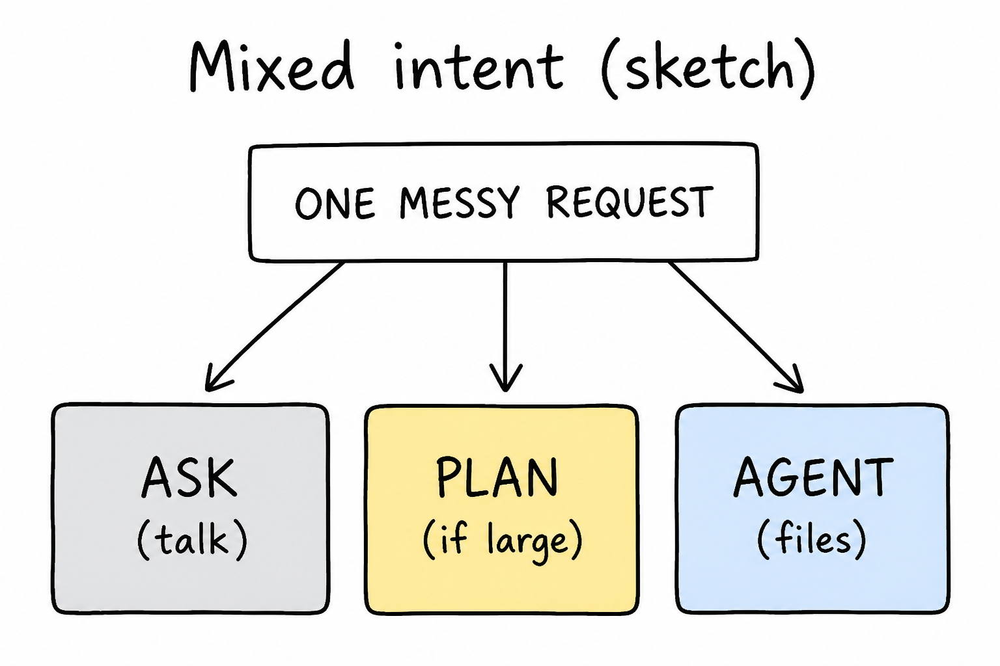
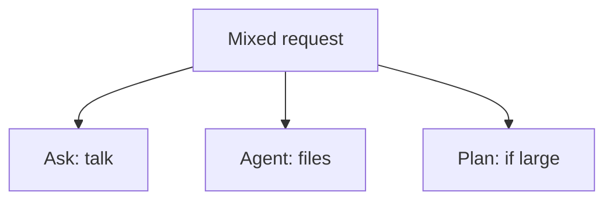

# Lesson 06: Messy tasks: switching Ask, Agent, and Plan

## Learning objectives

By the end of this lesson you should be able to:

- Decide what to do when a request is both “explain” and “change a file”
- Switch mode and re-ask instead of forcing the wrong mode
- Explain why the files on disk still win if chat already answered in the wrong mode

## Prerequisites

[Lessons 01–05](lesson-01.md): window, [Ask / Agent / Plan](lesson-02.md), [`@`](lesson-03.md), [quiz and ASK.md](lesson-04.md), [study loop](lesson-05.md). This lesson assumes those names.

## Key terms

- **Mixed intent** — one message that wants two outcomes, such as a quiz *and* an index edit
- **Mode switch** — changing Ask, Agent, or Plan and sending the request again, rather than arguing with a reply from the wrong mode

## Explanation

[Lesson 02](lesson-02.md) gave a clean chooser: Ask for talk, Agent for files, Plan for an outline. Real study messages are often mixed. The fix is not a fourth mode. Split the job, or switch and send again.

### Why mixed intent is common

You might type: “Quiz me on lesson 04 and mark it done.” That is two results:

- Questions and feedback (chat only) → [Ask](lesson-02.md)
- A learning-path row in [`index.md`](index.md) → [Agent](lesson-02.md)

One mode will do one half well and the other half poorly. Ask can quiz you and **must not** be trusted to have edited the table. Agent can edit the table and may also quiz, but you still confirm the file.

### Split, then switch

1. Name both outcomes (talk vs file).
2. Do the talk part in Ask (quiz, explanation).
3. Switch to Agent for the file part, with [`@` on the file to change](lesson-03.md) if it helps.
4. If the whole request is large or unclear (several lessons, a new subject), start in [Plan](lesson-02.md), then Agent only for the step you confirmed.

You do not need to undo a wrong-mode reply. The book did not change unless a file changed. Switch and ask the file half again.

### Disk still wins

If you used Ask and the chat says “I marked lesson 04 done,” open [`index.md`](index.md). If the row is still 🟡, Ask did not write the book. The sentence in chat is not progress.

If you used Agent and chat says a file was created, check Explorer. No file means the write did not happen, whatever the reply claimed.

## Media

- 🎥 Video: missing
- 🔊 Audio: missing
- 🖼️ Image: generated labeled diagram, not a Cursor screenshot

  

- 📊 Diagram:

## Worked example

You want: “Quiz me on lesson 04 and mark it done.”

1. Open [Ask](lesson-02.md). `@subjects/cursor/lesson-04.md`. Type: `Quiz me. Do not show answers until I try.` Finish the questions in chat.
2. Open [`index.md`](index.md) yourself. The lesson 04 row is still whatever it was; the quiz did not edit it.
3. Switch to [Agent](lesson-02.md). `@subjects/cursor/index.md`. Type: `Mark lesson-04 of cursor as done in index.md and update the media inventory.` only if you **did** study it — [lesson 04](lesson-04.md) and [HOW-TO-TUTOR.md](../../HOW-TO-TUTOR.md) say not to mark ✅ only because the file exists.
4. Open `index.md` in the editor. Confirm the status cell. If it did not change, the Agent step failed or you were still in Ask.

The quiz lived in chat. The status lives in the file. Two modes, one sitting.

## Practice questions

1. A message asks for an explanation of Plan mode and a new `lesson-16.md`. Why is that mixed intent?

Answer
Explanation is chat-only (Ask). Creating `lesson-16.md` is a file change (Agent). One message wants both.

2. You sent a mixed request in Ask and the reply says the index was updated. What do you do?

Answer
Open `index.md` in the editor. If the row did not change, switch to Agent and ask for the file edit. Chat is not the book.

3. When should you start in Plan instead of splitting Ask then Agent?

Answer
When the job is large or unclear: several lessons, a new subject, a rewrite — you want steps before files.

4. Does switching mode erase a quiz you already took in Ask?

Answer
No. The quiz was conversation. Switching mode only changes what the *next* message is allowed to do to files.

5. You used Agent for “explain Explorer” and it rewrote [lesson 01](lesson-01.md). What went wrong, and what is the repair?

Answer
The intent was talk-only; Agent was allowed to edit. Check the file, revert or restore the lesson text if needed, and use Ask for explanations.

## Quick quiz

Ask the agent: `Quiz me on lesson-06.` (5 short questions, mixed recall + application)

## Summary

Mixed requests need two outcomes named: talk vs files. Split them, switch mode, and re-ask. A confident reply in the wrong mode does not update the folder; Explorer and the editor do.

## Next

→ [Lesson 07](lesson-07.md) (pointing at more than one file)
