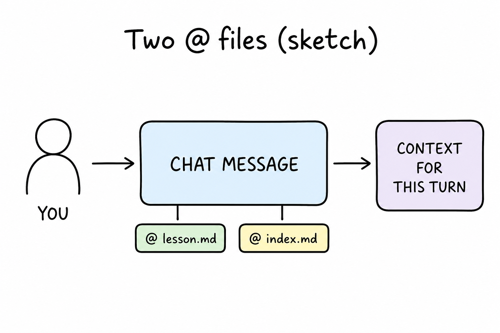
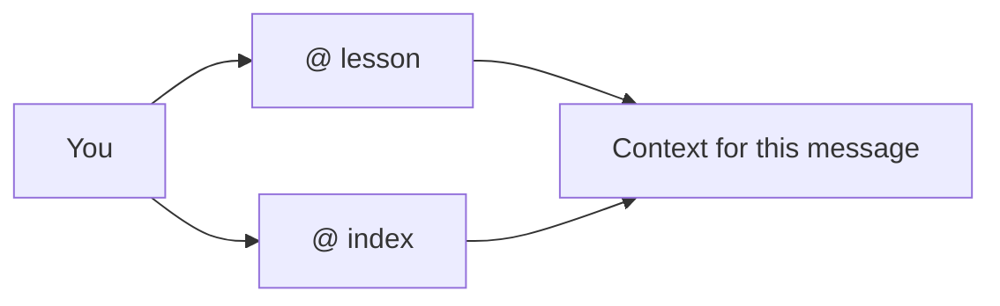

# Lesson 07: Pointing at more than one file

## Learning objectives

By the end of this lesson you should be able to:

- Combine `@` on a lesson plus `index.md` or [ASK.md](../../ASK.md) for a question that needs both
- Predict what goes wrong with no `@`, the wrong lesson, or only the index
- Choose file `@` over a vague “the Cursor subject”

## Prerequisites

[Lesson 03](lesson-03.md) (`@` and context) and [lesson 06](lesson-06.md) (mixed intent and mode switch). You already know one `@` hands the agent a specific file.

## Key terms

- **Multi-file `@`** — attaching more than one file to the same message so the agent is told to use both
- **Wrong attachment** — `@` on a file that does not contain the thing you asked about (wrong lesson, index instead of lesson, or nothing)

## Explanation

One `@` is enough for “quiz this lesson.” Many study questions need **two papers**: the lesson text and the progress table, or the lesson and the prompt list.

### When one file is not enough

| You want… | Attach |
|-----------|--------|
| Quiz on one lesson’s objectives | That `lesson-0X.md` |
| “Am I ready for the next band?” | The lesson you just finished **and** [`index.md`](index.md) |
| Exact wording from [ASK.md](../../ASK.md) plus a quiz | [ASK.md](../../ASK.md) **and** the lesson |
| “What is still `missing` in this subject?” | [`index.md`](index.md) (media inventory), not a random lesson |

Type `@` twice (or more) and pick each file. The message is then “use these.”

### What goes wrong

- **No `@`:** the agent may quiz the wrong lesson, invent a path, or answer from earlier chat.
- **Wrong lesson `@`:** you asked about [Ask vs Agent](lesson-02.md) but attached [lesson 01](lesson-01.md) — questions will drift to Explorer and the editor.
- **Only the index:** good for status and glossary; weak for a quiz on a lesson’s objectives. The learning-path table is not the explanation.
- **Vague “the Cursor subject”:** a folder is many files. Prefer the lesson and index you mean.

[Lesson 03](lesson-03.md) still holds: even with two `@`s, the agent does not see screenshots you never added or files you never mentioned.

### File `@` vs a subject nickname

Saying “quiz Cursor” without files is a nickname, not a pointer. The book’s Cursor subject is `subjects/cursor/`. Point at `lesson-07.md` and/or `index.md` by `@`, not by hoping the name is enough.

## Media

- 🎥 Video: missing
- 🔊 Audio: missing
- 🖼️ Image: generated labeled diagram, not a Cursor screenshot

  

- 📊 Diagram:

## Worked example

You finished [lesson 02](lesson-02.md) and want to know if you are ready for this intermediate band.

1. Chat, [Ask](lesson-02.md) is enough (no file edit).
2. `@` `subjects/cursor/lesson-02.md` and `@` `subjects/cursor/index.md`.
3. Type: `Am I ready for lesson 06? Use the lesson objectives and the learning-path table.`
4. A useful answer mentions modes (from lesson 02) **and** whether lessons 01–05 exist and are 🟡 or ✅ (from the index). If it only recites Ask/Agent/Plan and never mentions the table, you probably missed the index `@`. If it only talks status and never modes, you missed the lesson `@`.

That is the check: both attachments should show up in the reply’s evidence.

## Practice questions

1. You want a quiz on `@` mentions. Which file must be attached?

Answer
`lesson-03.md` — that is where those objectives live. The index alone is not the lesson.

2. You want “what should I study next in cursor?” Which attachment is the priority?

Answer
This subject’s `index.md` (learning path). A single old lesson file will bias the answer toward that lesson.

3. Why can attaching only [`index.md`](index.md) make a quiz feel shallow?

Answer
The index has titles, status, and glossary, not the full explanation or the lesson’s stated objectives.

4. You `@` lesson 05 and ask about Plan vs Agent. What is the likely failure?

Answer
Wrong attachment: lesson 05 is the study loop. Plan vs Agent is [lesson 02](lesson-02.md) (and [lesson 06](lesson-06.md) for mixed intent).

5. Is “quiz the Cursor subject” as precise as two `@` files?

Answer
No. Name the files with `@`. A subject nickname is not a pointer.

## Quick quiz

Ask the agent: `Quiz me on lesson-07.` (5 short questions, mixed recall + application)

## Summary

Many questions need two files: the lesson and the index, or the lesson and ASK.md. Attach both. No `@`, the wrong lesson, or only the index each fail in a predictable way. Prefer `@` files over a vague subject name.

## Next

→ [Lesson 08](lesson-08.md) (stronger study: objectives, live quiz, mixed review)
