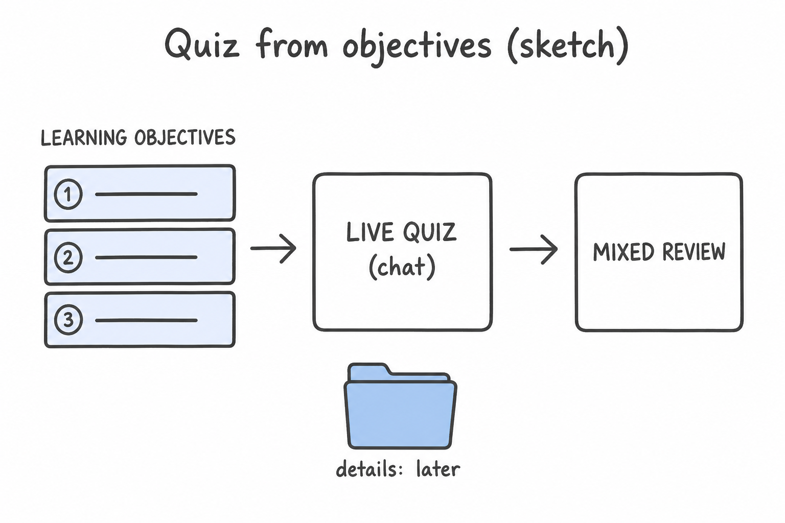
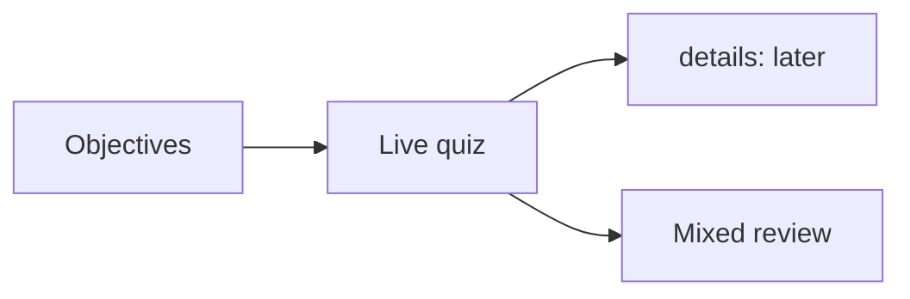

# Lesson 08: Stronger study: objectives, live quiz, mixed review

## Learning objectives

By the end of this lesson you should be able to:

- Tie a quiz to **learning objectives**, not only the hidden practice answers
- Keep live-quiz answers unspoiled until you try
- Ask for a short mix across earlier lessons when review is the goal

## Prerequisites

[Lessons 04–05](lesson-04.md) (quiz, ASK.md, study loop) and [lesson 07](lesson-07.md) (multi-file `@`).

## Key terms

- **Live quiz** — questions in chat, one at a time; you answer before the agent gives the key
- **Mixed review** — a short quiz that pulls from more than one lesson, not only the file you just read
- **Shaky objective** — a learning objective you missed or guessed; worth another pass

## Explanation

[Lesson 04](lesson-04.md) started quizzes from `@` plus a prompt. Stronger study means the questions track **what the lesson promised**, and review does not only repeat the last file.

### Objectives are the quiz spec

Each lesson lists 2–4 objectives at the top. [HOW-TO-TUTOR.md](../../HOW-TO-TUTOR.md) tells the agent to pull quiz items from those, not to copy the practice list verbatim.

When you `@` a lesson and say `Quiz me. Do not show answers until I try.`, a good first question should be answerable from an objective (identify, explain, decide). If every question is a word-for-word practice item, say so and ask: `Ask from the learning objectives, not the practice list.`

The `
` answers in the file are for **solo** study. During a live quiz, do not open them until you have tried in chat.

### After about five questions

Ask which objectives seemed solid vs shaky. That sentence is part of the loop, not extra credit. A shaky objective means re-read that headed section, then one more question on it — not a full new lesson unless the whole file is unclear.

### Mixed review vs one-lesson quiz

- **One lesson:** `@lesson-03.md` then quiz — for first pass or a weak objective.
- **Mix:** `@` two or three lessons, or use the [ASK.md](../../ASK.md) spaced-review prompt: `Give me a quick review quiz mixing lessons 01–03 of cursor.` Weight toward what you have not seen recently, not 01 then 02 then 03 in order if you just finished 03.

[Ask](lesson-02.md) is enough for quizzes. Agent is only if you also want [`index.md`](index.md) updated.

## Media

- 🎥 Video: missing
- 🔊 Audio: missing
- 🖼️ Image: generated labeled diagram, not a Cursor screenshot

  

- 📊 Diagram:

## Worked example

You want a first-pass quiz on [`@` mentions](lesson-03.md), then a short mix of 01–03.

1. [Ask](lesson-02.md). `@subjects/cursor/lesson-03.md`. `Quiz me on lesson-03 of cursor. Do not show answers until I try.`
2. Answer five questions from **objectives** (what `@` does, pointing on purpose, what is missed without `@`). Leave the practice `
` closed.
3. After five, ask which objectives were shaky.
4. Then `@lesson-01.md` `@lesson-02.md` `@lesson-03.md` (or the ASK.md mix prompt). `Three mixed questions; prefer 01 and 02 if 03 just went well.`
5. If a mixed question is about Plan and you never `@`’d lesson 02, stop and attach it — [lesson 07](lesson-07.md).

## Practice questions

1. Where should a live quiz get its targets from?

Answer
The lesson’s learning objectives, not only the hidden practice answers copied verbatim.

2. When are the `
` answers for?

Answer
Solo read-through. During a live quiz, try in chat first.

3. What do you ask after about five questions?

Answer
Which objectives seemed solid vs shaky.

4. You just finished lesson 03 and want review, not a repeat of only `@`. What kind of quiz?

Answer
A mixed review across earlier lessons (e.g. 01–03), weighted toward what is not fresh.

5. Live quiz only: Ask or Agent?

Answer
Ask. Agent is for file changes such as marking the index.

## Quick quiz

Ask the agent: `Quiz me on lesson-08.` (5 short questions, mixed recall + application)

## Summary

Quizzes should test the stated objectives. Keep `
` closed during a live quiz. After five questions, name shaky objectives. For review, mix older lessons instead of only the file you just read.

## Next

→ [Lesson 09](lesson-09.md) (small edits to an existing lesson)
