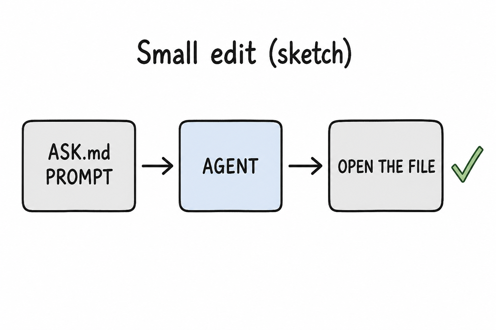
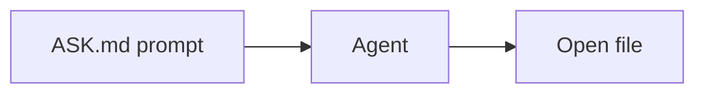

# Lesson 09: Small edits to an existing lesson

## Learning objectives

By the end of this lesson you should be able to:

- Use [Agent](lesson-02.md) (not [Ask](lesson-02.md)) for add/expand/rewrite/translate prompts from [ASK.md](../../ASK.md)
- Scope a **small** change (one example, a few questions) vs a new lesson file
- Check the open file after the edit

## Prerequisites

[Lesson 02](lesson-02.md) (Agent writes files) and [lesson 06](lesson-06.md) (do not mix “explain” with “edit” in one confused step). Planning a **new subject** is [lesson 12](lesson-12.md), not this lesson.

## Key terms

- **Small edit** — a bounded change to a file that already exists: extra practice questions, a worked example, a rewrite of one lesson’s level, a translation of one lesson
- **New lesson file** — a new `lesson-0X.md` (or project file). That is a bigger Agent job, still not a whole new subject

## Explanation

[ASK.md](../../ASK.md) has a **Building on a subject** list. Those prompts assume Agent. Ask can tell you *how* you might phrase an edit; it should not be where the new paragraph lives.

### Prompts that change an existing lesson

From [ASK.md](../../ASK.md), filled in for this subject:

- Expand: `Add a worked example and 3 more practice questions to lesson-05 of cursor.`
- Adjust level: `Rewrite lesson-0X of cursor for a beginner audience.` (only if you truly want that file rewritten)
- Translate: `Translate lesson-0X of cursor into <language>.`

Add a lesson is **not** a small edit: `Add lesson 0X to cursor, covering <topic>.` That creates (or should create) a new file. Use it when the learning path is supposed to grow, not when you only wanted one extra question.

### Scope before you send

Decide the smallest file outcome:

| You want… | Scope |
|-----------|--------|
| One extra practice question | Same `lesson-0X.md`, Agent |
| Three questions + a worked example | Same file, still Agent; say “expand” |
| A sixth beginner lesson | New `lesson-0X.md` — say so explicitly |
| A new folder for a different topic | New subject — Plan first ([lesson 12](lesson-12.md)) |

If you do not name the file, Agent may edit the wrong lesson or create a file you did not want. `@` the target file ([lesson 07](lesson-07.md)).

### Verify in the editor

After Agent replies, open the file. Quote the new line to yourself. If chat describes a change that is not in the editor, the edit did not land ([lesson 06](lesson-06.md): disk wins).

Housekeeping (glossary, media inventory, `updated` date) is required when a lesson **content** change is real — [lesson 14](lesson-14.md) treats that as the full checklist. For this lesson, at least confirm the lesson file itself.

## Media

- 🎥 Video: missing
- 🔊 Audio: missing
- 🖼️ Image: generated labeled diagram, not a Cursor screenshot

  

- 📊 Diagram:

## Worked example

Add one practice question to [lesson 05](lesson-05.md).

1. [Agent](lesson-02.md), not Ask.
2. `@subjects/cursor/lesson-05.md`. Optionally `@../../ASK.md` if you want the prompt pattern in context.
3. Type: `Add one practice question with a hidden details answer to lesson-05 of cursor, about what to do when Explorer has no lesson-06. Do not create a new file.`
4. Open `lesson-05.md` in the editor. Find the new numbered question in **Practice questions**. If it is missing, the write failed or you were in Ask.
5. Skim that you did not accidentally get a new `lesson-16.md`. Explorer should show the same lesson list plus the extra question in 05.

(This course later *does* add lesson 06 and beyond; the example is the **habit**: named file, small scope, then look.)

## Practice questions

1. Why is Ask the wrong mode for “add three practice questions to lesson 02”?

Answer
That result belongs in `lesson-02.md`. Ask should not rewrite book files. Use Agent.

2. Name two ASK.md “Building on a subject” actions that edit an existing lesson rather than adding a new one.

Answer
Expand a lesson; adjust level; translate. (Add a lesson creates a new file.)

3. You wanted one extra question and Agent created `lesson-16.md`. What was wrong with the scope?

Answer
The request was treated as a new lesson. You should name the existing file and say not to create a new one.

4. After Agent says it added a question, where do you confirm?

Answer
In the editor, in that lesson file. Chat can claim an edit that is not on disk.

5. Is “build a new subject about photosynthesis” a small edit?

Answer
No. That is a new folder and path. Use Plan ([lesson 12](lesson-12.md)), not a one-line expand prompt.

## Quick quiz

Ask the agent: `Quiz me on lesson-09.` (5 short questions, mixed recall + application)

## Summary

Building-on-a-subject prompts are Agent jobs. Keep the change small and named. Open the file afterward. A new lesson file or a new subject is a bigger request than one extra question.

## Next

→ [Lesson 10](lesson-10.md) (reading the subject index like a dashboard)
