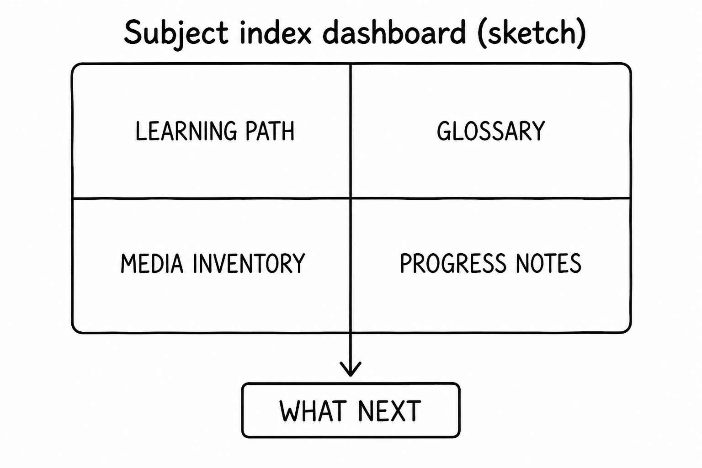
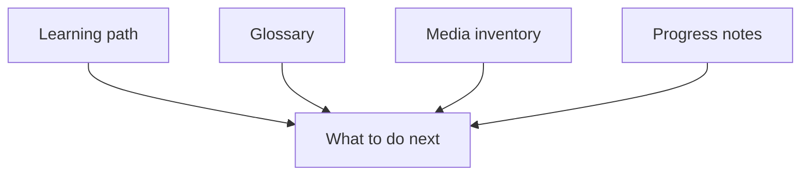

# Lesson 10: Reading the subject index like a dashboard

## Learning objectives

By the end of this lesson you should be able to:

- Read learning path, glossary, media inventory, and progress notes for **what to do next**
- Treat `missing` media as a gap list, not a broken book
- Mark ✅ only after you have studied, not because the file exists

## Prerequisites

[Lessons 04–05](lesson-04.md) (progress and study loop) and [lessons 08–09](lesson-08.md) (how you quiz and how Agent edits). Author-side housekeeping (always updating every table after a write) is [lesson 14](lesson-14.md).

## Key terms

- **Dashboard** — this subject’s [`index.md`](index.md) used as a status board: path, glossary, media, notes
- **Gap list** — the media inventory (and any `missing` in lessons); work to do later, not a failed lesson

## Explanation

[`index.md`](index.md) is not decoration. After a session you read it the way [lesson 05](lesson-05.md) said: does the row match how you feel, and what is next?

### Four panels

1. **Learning path** — ⬜ not started, 🟡 in progress, ✅ done. Written files can still be 🟡 if you have not studied. This subject’s beginner files were drafted as 🟡 on purpose.
2. **Glossary** — terms to review. If a quiz word is here, you can jump to **First seen**.
3. **Media inventory** — video/audio/image/diagram per lesson. `missing` means “not supplied,” not “the lesson is unusable.” Search the book for `missing` ([ASK.md](../../ASK.md) Media section) to see gaps across everything.
4. **Progress notes** — your log (or a sentence you asked Agent to add). Confusion belongs here, not only in chat history.

Frontmatter (`level`, `lessons_planned`, `updated`) is metadata. This subject’s `level` may still say beginner while later lessons are intermediate and advanced — trust the **learning path rows** and each lesson’s own `level`.

### What to do next (learner)

| You see… | Next |
|----------|------|
| 01–05 🟡, you understand the loop | [Beginner project](project-beginner.md), then lesson 06 |
| Shaky glossary term | Open **First seen**, `@` that lesson, one-objective quiz ([lesson 08](lesson-08.md)) |
| Many `missing` videos | Normal. Do not invent URLs. Optional: suggest what a video would show |
| You want the table updated | [Agent](lesson-02.md) + ASK.md maintenance — and only ✅ if you studied |

`@index.md` then `Summarize my progress in cursor and suggest what to study next.` should follow the path: after 05, the beginner project or lesson 06, **not** a skip to [lesson 11](lesson-11.md).

### ✅ is a study mark

A file on disk ≠ done. [HOW-TO-TUTOR.md](../../HOW-TO-TUTOR.md) and [lesson 04](lesson-04.md): mark done when you have studied, not because Agent generated the markdown.

## Media

- 🎥 Video: missing
- 🔊 Audio: missing
- 🖼️ Image: generated labeled diagram, not a Cursor screenshot

  

- 📊 Diagram:

## Worked example

You finished beginner lessons 01–05 as a reader.

1. Open [`index.md`](index.md). Read the learning-path rows for 01–05 (likely 🟡 unless you marked them).
2. Ask, `@subjects/cursor/index.md`: `Summarize my progress in cursor and suggest what to study next.`
3. A correct suggestion after 05 is the [beginner project](project-beginner.md) or, if the path already points there, that project — then intermediate lesson 06. A suggestion to jump to [lesson 11](lesson-11.md) (advanced verify) skips the intermediate band; say so and follow the table.
4. Glance at media inventory: video/audio `missing` is expected. You can still study.
5. If you actually studied 05, Agent may mark 05 ✅. If you only opened the file, leave 🟡.

## Practice questions

1. What are the four “panels” of this subject’s index this lesson cares about?

Answer
Learning path, glossary, media inventory, progress notes.

2. The lesson file exists but the row is 🟡. Are you done?

Answer
Not by the table. 🟡 means in progress; ✅ is after you study.

3. Video is `missing` on lesson 01. Is the lesson broken?

Answer
No. `missing` is a gap list. You can still use text, image, and mermaid.

4. After lesson 05, should “suggest what to study next” skip to lesson 11?

Answer
No. Follow the path: beginner project, then intermediate 06, not a jump to advanced.

5. You want only a summary of progress, no file changes. Mode?

Answer
Ask, with `@index.md`. Agent if you want the table edited.

## Quick quiz

Ask the agent: `Quiz me on lesson-10.` (5 short questions, mixed recall + application)

## Summary

The subject index is a dashboard: path, glossary, media gaps, and notes. `missing` is normal. ✅ is for study, not for “the file exists.” After beginner 05, next is the beginner project, then this intermediate band — not a skip to advanced.

## Next

→ [Intermediate project](project-intermediate.md) (quiz, mix, small verified edit)
