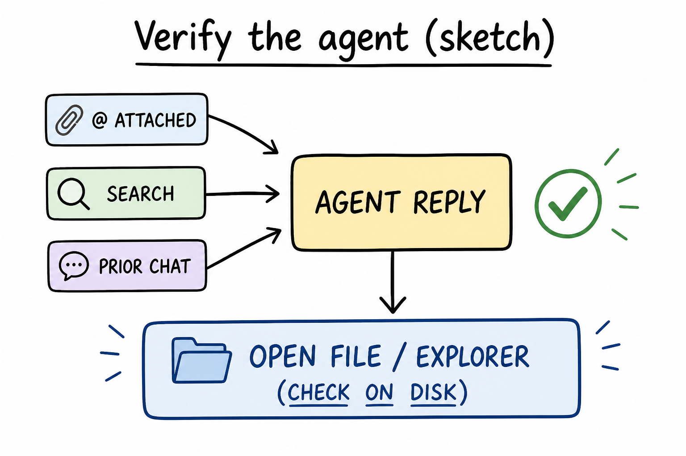
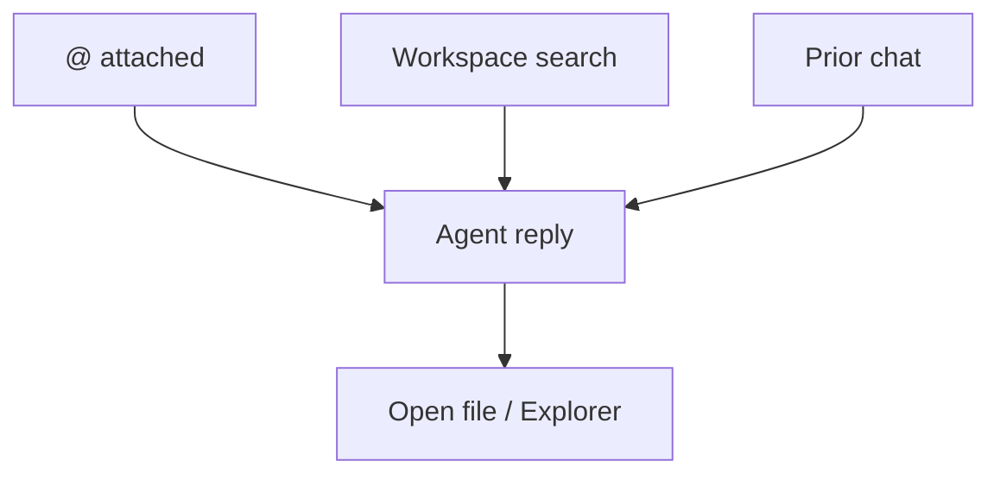

# Lesson 11: Context, rules, and verifying the agent

## Learning objectives

By the end of this lesson you should be able to:

- Distinguish `@`-attached context, folder search, and prior chat
- Attach [HOW-TO-TUTOR.md](../../HOW-TO-TUTOR.md) plus the relevant lesson or [`index.md`](index.md) when you want tutoring constraints
- Verify a claimed edit by opening the file (Explorer wins over chat)

## Prerequisites

[Lessons 06–10](lesson-06.md): mixed modes, multi-file `@`, quizzes, small edits, index as dashboard. Intermediate already taught “disk wins.” This lesson names **what the model is using** and **which rules bind it**.

## Key terms

- **Attached context** — files (and text) included on this message via `@` or equivalent
- **Workspace search** — the agent looking through the folder without you having `@`’d a specific file; useful, not a guarantee it opened the right lesson
- **Tutoring constraints** — [HOW-TO-TUTOR.md](../../HOW-TO-TUTOR.md) (and [ASK.md](../../ASK.md) as prompt catalog): pacing, media honesty, index housekeeping — not optional flavor if you attached them

## Explanation

[Lesson 03](lesson-03.md) called context “what the agent is looking at.” Precision: it is a **set** for this turn, not “Cursor knows the book.”

### Three sources (not one puddle)

1. **Attached `@`:** highest intent. You named the paper.
2. **Search / extra reads:** the agent may open other files. That can help or dilute. If the answer cites a path you did not attach, check Explorer; the path might be real or invented.
3. **Prior chat:** earlier turns are not the same as `@lesson-11.md`. A quiz “like last time” may drift.

Too little attachment → wrong lesson. Too much (`@` the whole `subjects/` tree) → instructions compete. Prefer the files the question actually needs ([lesson 07](lesson-07.md)) plus rules when behavior matters.

### Rules vs prompts

A prompt is what you want *this* time. [HOW-TO-TUTOR.md](../../HOW-TO-TUTOR.md) is how tutoring in **this book** is supposed to work: one lesson at a time unless you asked for a set; never fake media URLs; after lesson changes, update the subject index.

If you want that behavior, `@HOW-TO-TUTOR.md` (and the lesson/`index.md` you care about). [ASK.md](../../ASK.md) is wording. HOW-TO-TUTOR is policy. Attaching neither means you get a generic helpful agent, which may invent a `lesson-16.md` path or a video link.

### Verify loop

Agent claims an edit → open the file and the learning-path row → accept or send a correction. Invented paths: `lesson-16.md` when this subject has no such file, or a subject folder not listed in the book [index.md](../../index.md). Trust Explorer.

## Media

- 🎥 Video: missing
- 🔊 Audio: missing
- 🖼️ Image: generated labeled diagram, not a Cursor screenshot

  

- 📊 Diagram:

## Worked example

You want a glossary row added, under tutoring rules, and you will not take chat’s word for it.

1. [Agent](lesson-02.md). `@HOW-TO-TUTOR.md` `@subjects/cursor/index.md`.
2. Type: `Add a glossary row for the term attached context as defined in lesson 11. Update the glossary table only. Do not create lesson-16.md. Do not invent a video URL.`
3. Open `subjects/cursor/index.md`. Confirm the glossary row. If it is absent, the edit did not land.
4. In Explorer, confirm there is **no** `lesson-16.md`. If chat told you to open it, that path is invented until you ask to add that lesson.

Optional: `@lesson-11.md` as well so the definition matches this file.

## Practice questions

1. Name three different sources of what the agent might use on a turn.

Answer
`@`-attached files, other files it searches or opens, and prior chat. They are not the same guarantee.

2. You want tutoring policy (no fake URLs, index housekeeping). What file should be attached?

Answer
`HOW-TO-TUTOR.md`, plus the lesson or `index.md` you are changing.

3. Chat says it created `lesson-16.md`. Explorer has no such file. What is true?

Answer
The file does not exist. Explorer wins. Do not invent the path.

4. Why can `@` on the entire `subjects/` folder be worse than two specific files?

Answer
Too much context dilutes the instruction; the agent may attend to the wrong lesson.

5. After Agent reports a glossary update, what is the verification step?

Answer
Open `index.md` in the editor and read the glossary table.

## Quick quiz

Ask the agent: `Quiz me on lesson-11.` (5 short questions, mixed recall + application)

## Summary

Context is a set: attachments, possible search, and chat history. Attach HOW-TO-TUTOR when you want this book’s rules. Verify every claimed write in Explorer and the editor; invented paths are not lessons.

## Next

→ [Lesson 12](lesson-12.md) (Plan mode for a subject, then files on disk)
