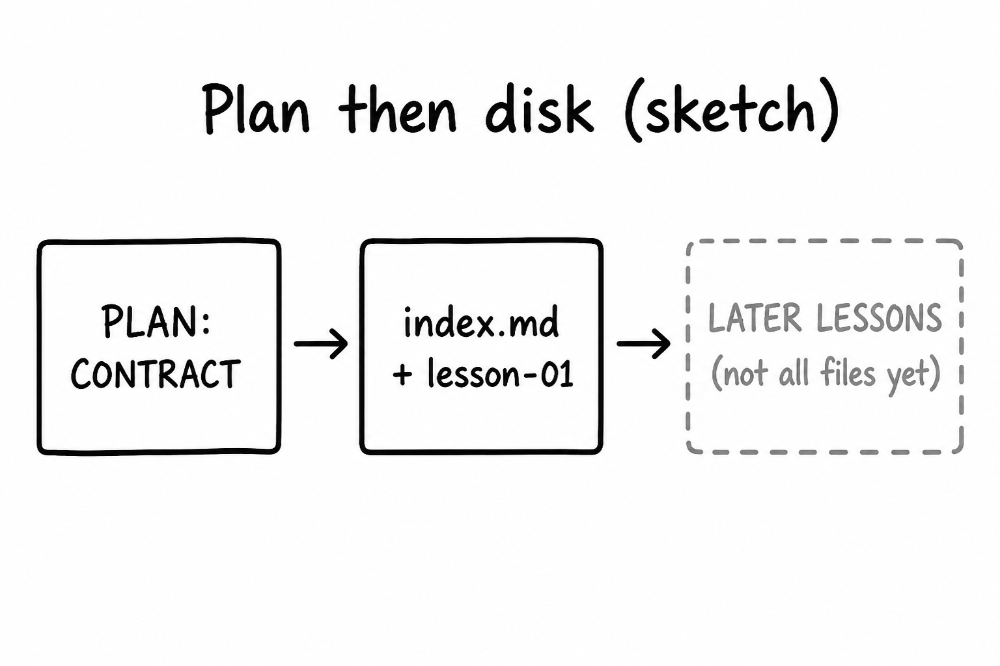

# Lesson 12: Plan mode for a subject, then files on disk

## Learning objectives

By the end of this lesson you should be able to:

- Use [Plan](lesson-02.md) to lock level, lesson count, language, and learning-path rows before files exist
- Explain why a confirmed plan is not the same as every `lesson-0X.md` existing
- Choose Plan vs Agent for outline vs write-this-file-now; note batch-write only when the learner asked for the whole set

## Prerequisites

[Lesson 11](lesson-11.md) (attach [HOW-TO-TUTOR.md](../../HOW-TO-TUTOR.md), verify disk). [Lesson 02](lesson-02.md) / [lesson 06](lesson-06.md) for Plan vs Agent. [Lesson 09](lesson-09.md) was small edits to an **existing** lesson.

## Key terms

- **Learning-path contract** — the table in a subject `index.md`: one row per planned lesson, status ⬜ until work starts
- **Batch write** — generating many lesson files in one go; [HOW-TO-TUTOR.md](../../HOW-TO-TUTOR.md) allows this only when the learner asks for the whole set

## Explanation

[Plan](lesson-02.md) is for work you do not want as surprise files. A **subject** is slug, `index.md`, `lesson-01.md` first, `images/`, and a row in the book [index.md](../../index.md) ([subjects/README.md](../README.md)).

### What Plan should lock

[HOW-TO-TUTOR.md](../../HOW-TO-TUTOR.md) asks up front: **level**, **how many lessons** (default 5), **language**. The plan should also list titles or key topics so the learning-path table can be filled with ⬜ rows.

Until you confirm, Explorer should not gain `subjects/<slug>/`. After confirm, Agent (or Plan continuing into build) may create files — **then** you verify ([lesson 11](lesson-11.md)).

### Confirmed plan ≠ all lesson files

Pacing: generate **one lesson at a time** by default. `index.md` can list five ⬜ rows while only `lesson-01.md` exists. That is correct, not a bug. A confirmed plan is the contract; disk fills as you ask.

**Exception:** you explicitly asked for the whole set (this Cursor expansion did). Then batch-write is allowed. If you did not ask, do not compress five lessons into one dump, and do not skip Plan when the task is a new subject.

If a lesson drags, split it into two rather than compressing ([HOW-TO-TUTOR.md](../../HOW-TO-TUTOR.md) Difficulty).

### Plan vs Agent

| Goal | Mode |
|------|------|
| Outline level, count, language, row titles | Plan |
| Write `lesson-01.md` now | Agent (after the plan exists or is agreed) |
| Whole set because you said so | Agent (or confirmed Plan that includes batch) |

[ASK.md](../../ASK.md): `Build tutoring lessons for SUBJECT. Ask me level, how many lessons, and language first.`

## Media

- 🎥 Video: missing
- 🔊 Audio: missing
- 🖼️ Image: generated labeled diagram, not a Cursor screenshot

  

- 📊 Diagram:

## Worked example

Hypothetical 3-lesson subject, **not** written unless you later ask Agent.

1. [Plan](lesson-02.md). `@HOW-TO-TUTOR.md` `@ASK.md`.
2. Type: `Plan tutoring lessons for paper-folding, intermediate, 3 lessons, English. Do not create files yet.`
3. The outline should include slug `paper-folding`, three learning-path rows, lesson 01 topic. It should **not** require `subjects/paper-folding/lesson-03.md` to exist today.
4. First disk step after you confirm and want files: copy template → `subjects/paper-folding/index.md` + `lesson-01.md` + `images/`, plus a book index row — **unless** you said “write all three lessons now.”
5. If Explorer shows `paper-folding` and you never confirmed, that was Agent too early. Check the folder; do not assume the plan file in chat is the book.

Do not invent `subjects/paper-folding/` in this worked example’s narrative as if it already exists in **this** repo unless you actually created it.

## Practice questions

1. Which three questions should Plan settle before a new subject’s files exist?

Answer
Level, how many lessons, and language.

2. The subject `index.md` lists five lessons, all ⬜, and only `lesson-01.md` is in Explorer. Is that a broken plan?

Answer
No. Default pacing is one lesson at a time. The table is the contract.

3. When is writing all lesson files in one batch allowed?

Answer
When the learner explicitly asks for the whole set.

4. You want only the outline, no folders. Ask, Agent, or Plan?

Answer
Plan. Agent is for when you want files. Ask will not create the subject folder.

5. A lesson feels too long. What does HOW-TO-TUTOR prefer over compressing?

Answer
Split it into two lessons.

## Quick quiz

Ask the agent: `Quiz me on lesson-12.` (5 short questions, mixed recall + application)

## Summary

Plan locks level, count, language, and path rows. Confirming the outline is not the same as every lesson file existing. Write `lesson-01.md` first unless you asked for the whole set. Verify folders in Explorer.

## Next

→ [Lesson 13](lesson-13.md) (media slots: mermaid, images, and `missing`)
