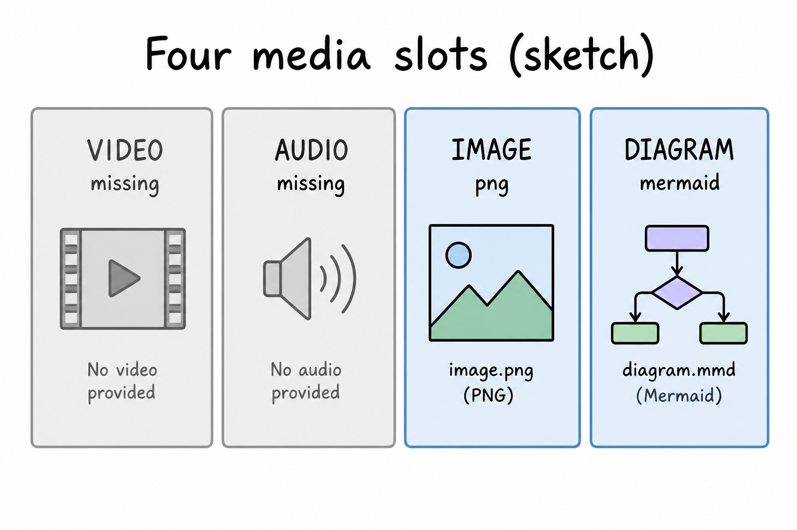
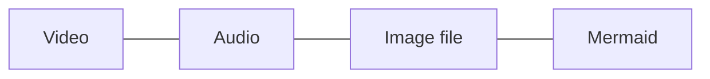

# Lesson 13: Media slots: mermaid, images, and `missing`

## Learning objectives

By the end of this lesson you should be able to:

- Keep all four media slots; treat `missing` as a real gap, not a skip
- Choose mermaid vs a file in `images/` vs a real URL
- Refuse invented video/audio links

## Prerequisites

[Lessons 11–12](lesson-11.md): verify disk, do not invent paths. [Lesson 10](lesson-10.md) already treated `missing` as a learner-facing gap list.

## Key terms

- **Media slot** — one of video, audio, image, diagram on every lesson; never deleted to hide a gap
- **Honest `missing`** — the word `missing` in a slot (and the inventory table) meaning no real asset yet

## Explanation

[HOW-TO-TUTOR.md](../../HOW-TO-TUTOR.md) Media: never invent a fake URL or claim a file exists. If you cannot produce or find real media, leave `missing` and say so. Suggest what visual would help.

### Four slots, always

Every lesson (and these projects) keeps:

- 🎥 Video
- 🔊 Audio
- 🖼️ Image
- 📊 Diagram

Deleting a slot because you have nothing is worse than `missing`. `missing` is a signal for later ([ASK.md](../../ASK.md): search the book for `missing`).

The subject [`index.md`](index.md) **media inventory** should match the lesson. After a lesson change, update that row ([lesson 14](lesson-14.md)).

### What to put in each

| Slot | Honest content |
|------|----------------|
| Video | Real URL or `video.mp4` next to the lesson (gitignored pattern in this book) — or `missing` |
| Audio | Real URL or `audio.mp3` — or `missing` |
| Image | File under `subjects/cursor/images/` ([images/README.md](images/README.md)) or a real URL; this course uses generated labeled diagrams, not fake screenshots |
| Diagram | Mermaid in the lesson, or `missing` if you truly have none |

Mermaid is text in the markdown. An `images/*.png` is a file you can `@` or embed. Do not paste a made-up `https://example.com/lesson.mp4`.

### Inventory vs lesson

If the lesson says image exists and the inventory says `missing`, the dashboard is wrong — fix one of them after you look in `images/`. Search the book for `missing` to list gaps; do not invent rows for lessons that are not in Explorer.

## Media

- 🎥 Video: missing
- 🔊 Audio: missing
- 🖼️ Image: generated labeled diagram, not a Cursor screenshot

  

- 📊 Diagram:

## Worked example

You add a mermaid flowchart to a lesson and keep video honest.

1. The lesson already has four slot lines. You add or keep a `mermaid` block under Diagram.
2. You do **not** write a fake YouTube URL for Video. Leave `missing`.
3. [Agent](lesson-02.md) `@subjects/cursor/index.md` `@HOW-TO-TUTOR.md`: `Set this lesson’s media inventory: video missing, audio missing, image the png filename, diagram mermaid.`
4. Open the lesson and the inventory row. They must agree. Explorer must contain the png if the lesson embeds it.

If chat offers `https://cdn.fake/cursor-lesson13.mp4`, reject it. Suggest instead: “a short screen recording of the four headings in the Media section.”

## Practice questions

1. Why keep a Video line that says `missing`?

Answer
The slot is a later-work signal. Deleting it hides the gap.

2. Where do subject screenshots and diagrams-as-files go?

Answer
`subjects/<slug>/images/` — see this subject’s `images/README.md`. Not `video.mp4` in that folder.

3. The agent invents a video URL. What do you do?

Answer
Refuse it. Leave `missing`. You may suggest what a real video would show.

4. When is mermaid a better diagram than a PNG?

Answer
When a simple flowchart or table of flow is enough and you want it in the markdown (diffable, no extra file). Use a PNG when you need a labeled sketch like lessons 01–05.

5. Lesson says image exists; inventory says `missing`; `images/` has no file. What is honest?

Answer
Both should say `missing` (or you add a real file and then update both).

## Quick quiz

Ask the agent: `Quiz me on lesson-13.` (5 short questions, mixed recall + application)

## Summary

Four media slots stay on every lesson. `missing` is honest. Mermaid, `images/`, or a real URL — never a fake link. Keep the media inventory aligned with the files you can actually open.

## Next

→ [Lesson 14](lesson-14.md) (index, glossary, status, and ASK.md maintenance)
