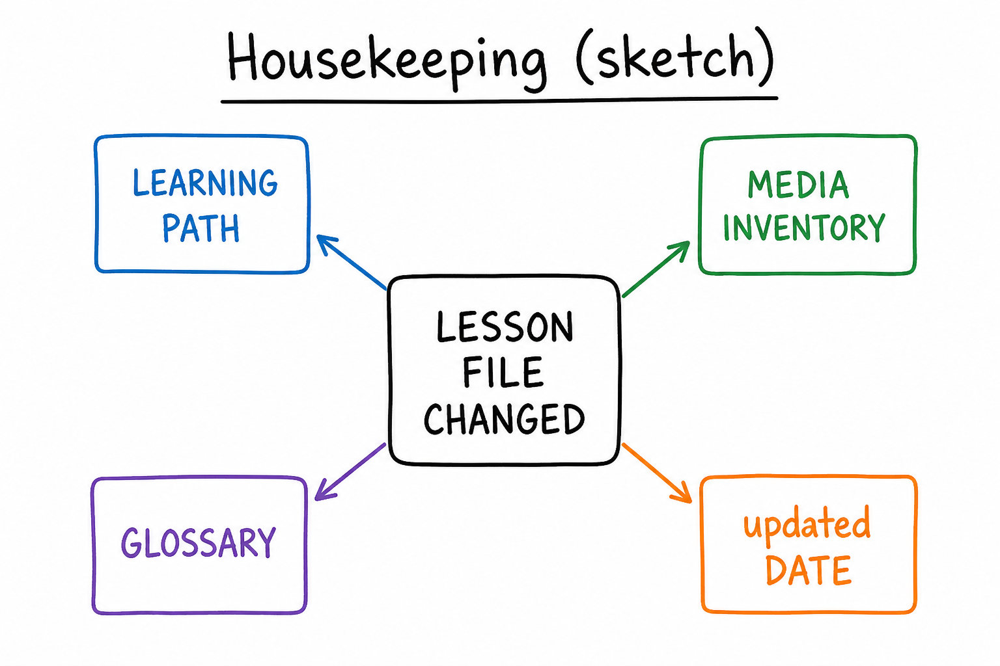
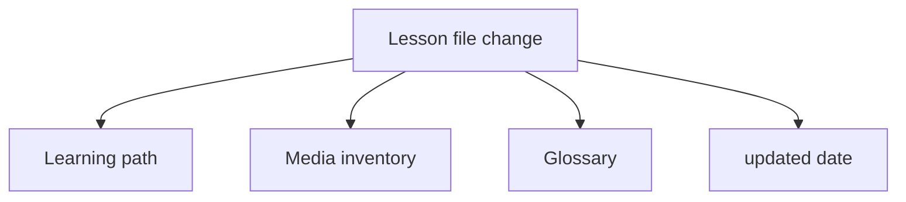

# Lesson 14: Index, glossary, status, and ASK.md maintenance

## Learning objectives

By the end of this lesson you should be able to:

- After any lesson change, update learning path, media inventory, glossary, and `updated`
- Pick the right maintenance prompt from [ASK.md](../../ASK.md)
- Mark ✅ only after study

## Prerequisites

[Lessons 11–13](lesson-11.md): verify writes, Plan vs disk, honest media. [Lesson 10](lesson-10.md) is the learner reading the dashboard; this lesson is **keeping the dashboard true**.

## Key terms

- **Housekeeping** — the index updates that follow a lesson change, without a separate “please update the index” if you are already the Agent writing the lesson
- **Maintenance prompt** — an [ASK.md](../../ASK.md) Maintenance (or Studying) snippet you paste when you want those tables updated on purpose

## Explanation

[HOW-TO-TUTOR.md](../../HOW-TO-TUTOR.md) **Keeping index.md current**: after any change to a lesson, update that row’s status and key topic, the media inventory row, glossary if new terms, and bump `updated` in frontmatter. Do not wait for permission — it is part of the same Agent turn when the agent is writing the lesson.

When **you** studied but the writer already left 🟡, you use a maintenance prompt to mark ✅.

### Checklist after a lesson text change

1. Learning-path row: number, title link, status (still 🟡 for drafts), key topic.
2. Media inventory: four cells matching the lesson’s Media section ([lesson 13](lesson-13.md)).
3. Glossary: new terms from this lesson only; do not redefine old terms — point **First seen** at the lesson.
4. Frontmatter `updated` (and `lessons_planned` if the path grew).
5. Book [index.md](../../index.md) if the subject’s lesson count changed.

Progress notes: optional learner log, not a dump of the Agent’s chat.

### ASK.md prompts (fill in cursor / 0X)

**Maintenance**

- `Find or suggest media for lesson-0X of cursor where media is "missing".` — suggestions only; no fake URLs.
- `Extract new terms from lesson-0X and add them to cursor/index.md glossary.`
- `Mark lesson-0X of cursor as done in index.md and update the media inventory.`

**Studying**

- `Summarize my progress in cursor and suggest what to study next.` — Ask + `@index.md` unless you also want edits.

Mark ✅ only after study, not because the markdown file exists ([lesson 04](lesson-04.md), [lesson 10](lesson-10.md)).

### Agent vs Ask

Updating tables is a file edit → [Agent](lesson-02.md), `@index.md` (and the lesson). Attach [HOW-TO-TUTOR.md](../../HOW-TO-TUTOR.md) if the agent skips housekeeping ([lesson 11](lesson-11.md)). Then open `index.md` and confirm.

## Media

- 🎥 Video: missing
- 🔊 Audio: missing
- 🖼️ Image: generated labeled diagram, not a Cursor screenshot

  

- 📊 Diagram:

## Worked example

Lesson text changed (new key term + mermaid). Walk the checklist on [`index.md`](index.md).

1. Open the lesson; note the new term and that Diagram is mermaid, Video still `missing`.
2. Agent: `@HOW-TO-TUTOR.md` `@subjects/cursor/index.md` `@subjects/cursor/lesson-14.md`.
3. `Extract new terms from lesson-14 and add them to cursor/index.md glossary. Align the media inventory row for 14. Bump updated. Do not mark the lesson ✅.`
4. Open `index.md`. Glossary has **Housekeeping** / **Maintenance prompt**. Inventory row 14: missing / missing / png / mermaid. `updated` is today. Status still 🟡.
5. If you later study lesson 14, then: `Mark lesson-14 of cursor as done in index.md and update the media inventory.`

## Practice questions

1. List the index pieces to update after a lesson change.

Answer
Learning-path row, media inventory row, glossary if new terms, `updated` date. Book index if lesson count changed.

2. Which ASK.md prompt marks a lesson done?

Answer
`Mark lesson-0X of cursor as done in index.md and update the media inventory.`

3. Should Agent mark ✅ in the same turn it first writes a draft lesson you have not studied?

Answer
No. Drafts stay 🟡 (or ⬜). ✅ is after study.

4. You only want a progress summary. Mode and `@`?

Answer
Ask, `@index.md`. Agent if you want the tables rewritten.

5. New term already defined in lesson 02. What goes in the glossary?

Answer
Do not duplicate a new definition. Link back; glossary **First seen** stays lesson 02 unless you are correcting an error.

## Quick quiz

Ask the agent: `Quiz me on lesson-14.` (5 short questions, mixed recall + application)

## Summary

Lesson edits and index edits belong together: path, media, glossary, date. Use ASK.md maintenance prompts on purpose. ✅ means you studied. Verify `index.md` on disk.

## Next

→ [Lesson 15](lesson-15.md) (multi-subject book: search, review, next subject)
