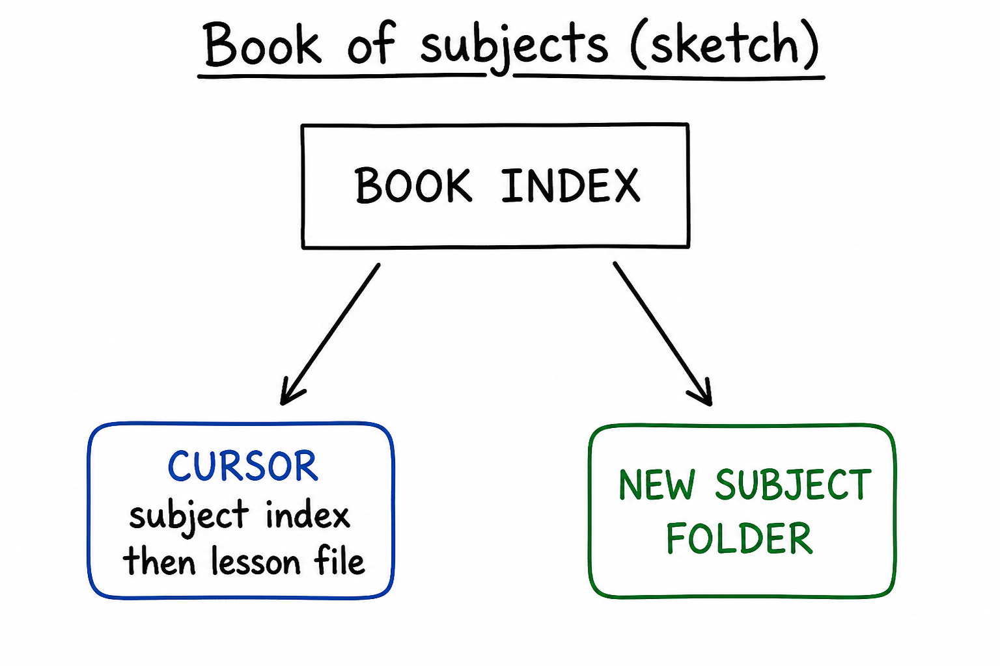
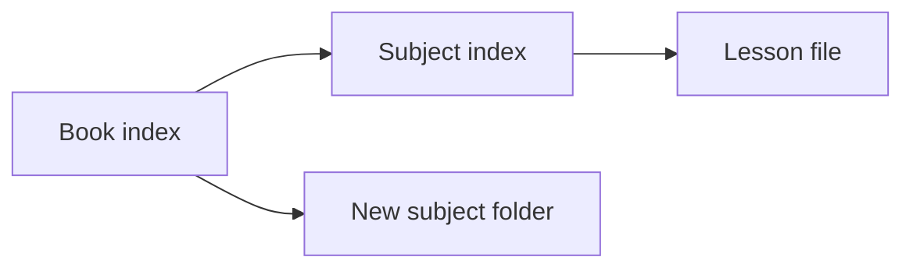

# Lesson 15: Multi-subject book: search, review, next subject

## Learning objectives

By the end of this lesson you should be able to:

- Use book [index.md](../../index.md) plus subject [`index.md`](index.md) to find a topic or say it does not exist
- Run spaced review weighted toward older or shaky objectives
- Start a **different** subject without breaking this Cursor path

## Prerequisites

[Lessons 11–14](lesson-11.md): context and rules, Plan then disk, honest media, housekeeping.

## Key terms

- **Book index** — root [index.md](../../index.md): list of subjects, not the Cursor learning path
- **Search vs invent** — find a real path in Explorer / these indexes, or say there is no lesson; never fabricate `subjects/foo/lesson-01.md`

## Explanation

This folder is a **book** of subjects ([README.md](../../README.md)). Cursor is one row. Finding “verifying the agent” is not the same as starting photosynthesis.

### Find or say no

[ASK.md](../../ASK.md) Find a topic:

- `@index.md Find the subject or lesson about Y.`
- `Search this book for Y. If there is no lesson, say so. Do not invent a file path.`

Attach the **book** index for “which subject,” the **subject** index for “which lesson in Cursor.” If Explorer has no file, the answer is “no lesson,” not a helpful fake path ([lesson 11](lesson-11.md)).

“Verifying the agent” in this subject is [lesson 11](lesson-11.md), not lesson 06 (that is mixed Ask/Agent/Plan).

### Spaced review across the book

[Lesson 08](lesson-08.md) mixed review inside Cursor. Across a long path, weight questions toward material **not seen recently** and toward shaky objectives ([HOW-TO-TUTOR.md](../../HOW-TO-TUTOR.md) Quizzing). Example: mix [lesson 02](lesson-02.md), [lesson 11](lesson-11.md), [lesson 14](lesson-14.md) — modes, verify, housekeeping.

Ask is enough. `@` the lesson files (or say the mix and attach them).

### New subject without breaking Cursor

[ASK.md](../../ASK.md) Build lessons. [Lesson 12](lesson-12.md): Plan first (level, count, language), then files. Use a **new slug**. Do not overwrite `subjects/cursor/` to “make room.” After the new subject exists, the book index gains a row; Cursor’s 15 lessons and three projects stay.

Stuck: wrong subject `@`, missing file, chat/file disagreement — Explorer wins; switch mode ([lesson 06](lesson-06.md)); attach HOW-TO-TUTOR.

## Media

- 🎥 Video: missing
- 🔊 Audio: missing
- 🖼️ Image: generated labeled diagram, not a Cursor screenshot

  

- 📊 Diagram:

## Worked example

1. Ask. `@../../index.md` `@subjects/cursor/index.md`. `Find the lesson about verifying the agent. If none, say so.`
2. Expected: [lesson 11](lesson-11.md) in Cursor — not an invented `lesson-16.md`.
3. `@lesson-02.md` `@lesson-11.md` `@lesson-14.md`. `Three mixed review questions; weight 02 and 14 if 11 was recent.`
4. Plan (do not write unless you ask): `Plan tutoring lessons for a different subject, beginner, 3 lessons. Do not modify subjects/cursor/.`
5. If you then Agent-build that other subject, verify a **new** folder and that `subjects/cursor/lesson-15.md` is unchanged.

## Practice questions

1. Where do you look first to see which subjects exist?

Answer
The book `index.md` at the repo root.

2. Search finds nothing. What should the agent not do?

Answer
Invent a file path. Say there is no lesson.

3. Which Cursor lesson is “verifying the agent”?

Answer
Lesson 11, not lesson 06.

4. Why mix lessons 02, 11, and 14 for review?

Answer
They are different bands and topics (modes, verify, housekeeping); spaced review should not only repeat the last file.

5. Building photosynthesis: may Agent reuse `subjects/cursor/`?

Answer
No. New slug and folder. Cursor’s path stays.

## Quick quiz

Ask the agent: `Quiz me on lesson-15.` (5 short questions, mixed recall + application)

## Summary

Book index lists subjects; subject index lists lessons. Search and admit gaps. Review across older and shaky objectives. A new subject is a new folder — Plan, then Agent — without rewriting Cursor.

## Next

→ [Advanced project](project-advanced.md) (plan, constrain, verify, don’t invent)
