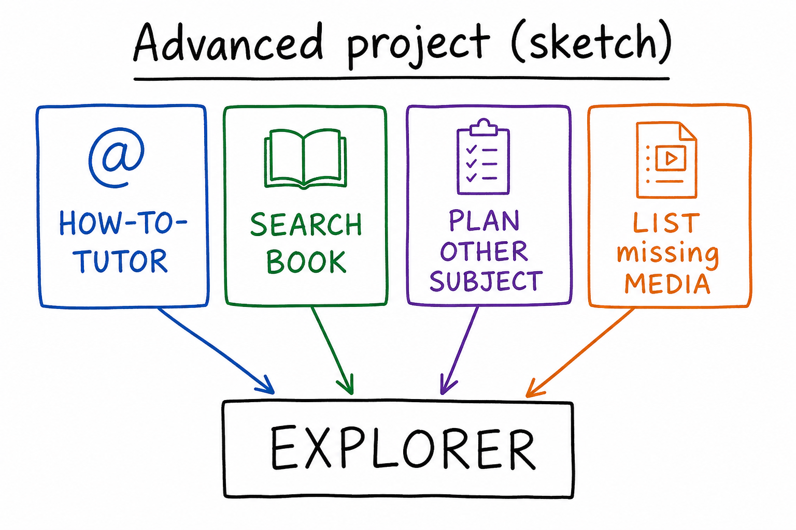
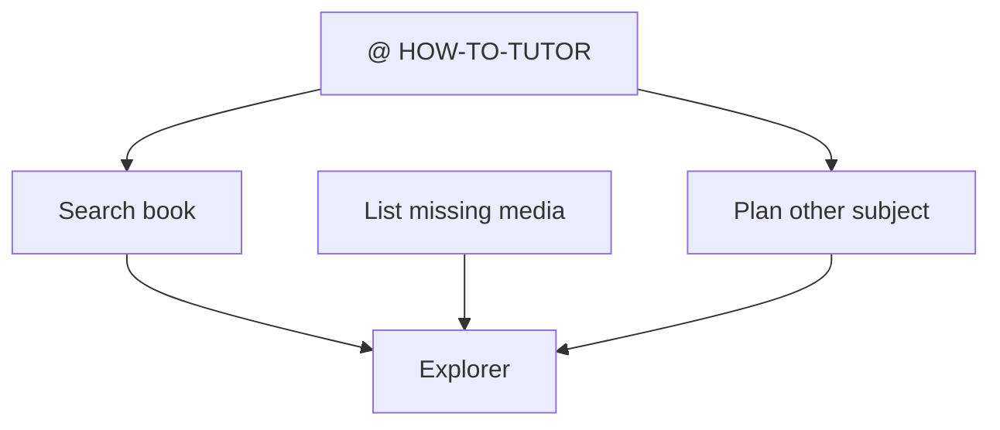

# Project (advanced): Plan, constrain, verify, don’t invent

## Learning objectives

By the end of this project you should be able to:

- Attach [HOW-TO-TUTOR.md](../../HOW-TO-TUTOR.md) plus a book or subject `index.md` for constrained work
- Produce a Plan for a **different** 2–3 lesson subject without writing that subject unless you clearly ask Agent afterward
- Search this book, refuse a path that is not in Explorer, and list remaining `missing` media for Cursor

## Prerequisites

[Lessons 11–15](lesson-11.md).

## Key terms

- **Constraint attachment** — `@HOW-TO-TUTOR.md` so pacing, media honesty, and housekeeping apply
- Link back: [verify](lesson-11.md), [Plan then disk](lesson-12.md), [honest missing](lesson-13.md), [search vs invent](lesson-15.md)

## Deliverable

(1) `@HOW-TO-TUTOR.md` plus subject or book [`index.md`](index.md) / [index.md](../../index.md). (2) A Plan for another subject (level, count, language, learning-path rows) **without** creating that folder unless you explicitly ask Agent after. (3) Search for one topic; refuse invented paths (`lesson-16.md` if it is not in Explorer). (4) List remaining `missing` media for Cursor from the inventory (and spot-check a lesson).

Success: a plan you could confirm later; no new fake files; media list matches what you observed.

## Explanation

### Steps

1. [Plan](lesson-02.md) or Ask for search; Agent only for steps that must change disk.
2. `@HOW-TO-TUTOR.md` `@../../index.md` (and `@subjects/cursor/index.md` for media).
3. Search: `Find the lesson about verifying the agent. If there is no lesson, say so. Do not invent a file path.` Expect [lesson 11](lesson-11.md).
4. Plan: `Plan tutoring lessons for SUBJECT, beginner, 3 lessons, English. Do not create files. Do not modify subjects/cursor/.` SUBJECT is **not** Cursor.
5. Ask or Agent (read-only habit): `Search this book for "missing". List Cursor lesson/project slots that are still missing.` Compare to the media inventory table in [`index.md`](index.md).
6. Explorer: confirm you did **not** get a new subject folder unless you asked. Confirm no `lesson-16.md` unless you asked to add it.

### Success

Chat’s plan is an outline. Disk still has Cursor’s files (and this project). Video/audio `missing` on new lessons is expected and must be reported as `missing`, not as fake URLs.

## Media

- 🎥 Video: missing
- 🔊 Audio: missing
- 🖼️ Image: generated labeled diagram, not a Cursor screenshot

  

- 📊 Diagram:

## Worked example

1. Ask: `@../../index.md` `@subjects/cursor/index.md` `@HOW-TO-TUTOR.md` — find “verifying the agent” → lesson 11. Ask whether `lesson-16.md` exists; if Explorer has none, the answer is no.
2. Plan a 3-lesson **other** subject. Stop. Do not Agent-build it for this project unless you decide that is extra credit **and** you want those files.
3. Open Cursor `index.md` media inventory. List every `missing` in video/audio (lessons 01–15 and three projects). That list is part of the deliverable.
4. If Agent offers `https://fake.video/cursor.mp4`, reject it ([lesson 13](lesson-13.md)).

## Checklist

- [ ] HOW-TO-TUTOR was `@`’d for the constrained steps
- [ ] Search named a real file or honestly said none
- [ ] Other-subject Plan did not create a folder unless I asked
- [ ] I listed Cursor `missing` media from the inventory / files
- [ ] Explorer matches what I claim exists

## Practice questions

1. Which lesson should “verifying the agent” resolve to?

Answer
[Lesson 11](lesson-11.md).

2. Does this project require creating the planned other subject?

Answer
No. The deliverable is the plan you could confirm later, plus search and missing-media list.

3. What if chat cites `subjects/made-up/lesson-01.md`?

Answer
Check Explorer. If it is missing, say so. Do not invent the path.

## Quick quiz

Ask the agent: `Quiz me on the advanced Cursor project.`

## Summary

Attach the tutoring rules. Plan a different subject without sneaking files onto disk. Search without inventing. Report `missing` media as gaps. This subject’s path ends at the subject [index.md](index.md).

## Next

→ Subject [`index.md`](index.md) or the book [index.md](../../index.md). The Cursor path is complete at lesson 15 plus this project.
