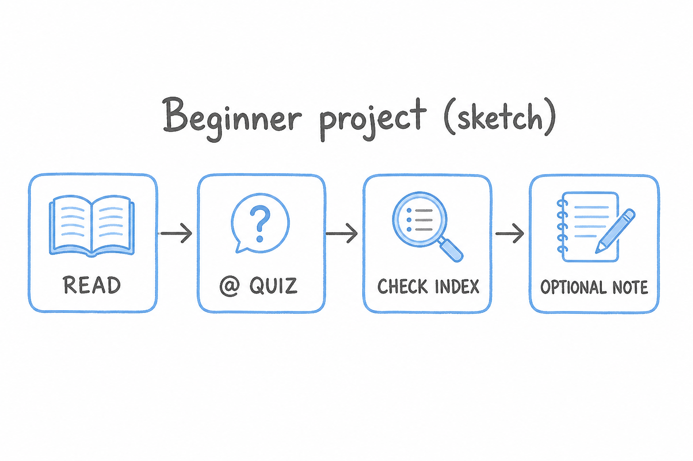
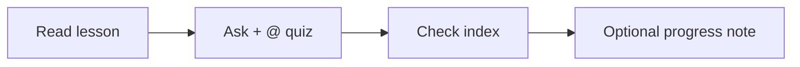

# Project (beginner): One full study loop

## Learning objectives

By the end of this project you should be able to:

- Run read → `@` → quiz → check `index.md` on **one** beginner lesson
- Name which chat mode you used for the quiz
- Leave ✅ alone unless you actually studied that lesson

## Prerequisites

[Lessons 01–05](lesson-01.md). Recommended target: [lesson 04](lesson-04.md) or [lesson 05](lesson-05.md).

## Key terms

- **Deliverable** — the observable result of this project (a loop you can repeat, plus an optional progress note)
- Link back: [study loop](lesson-05.md), [Ask](lesson-02.md), [`@`](lesson-03.md)

## Deliverable

You can complete one study loop on a single beginner lesson and say: I used **Ask** (or Agent, if you also changed a file). Optional: one sentence under **Progress notes** in [`index.md`](index.md), added with Agent — not a fake ✅.

## Explanation

This is [lesson 05](lesson-05.md) as a sitting, not a new product feature. The project *is* the work; the checklist below is how you know you finished.

### Steps

1. In Explorer, open `subjects/cursor/lesson-04.md` or `lesson-05.md`. Read **Learning objectives** and **Explanation** in the editor.
2. Chat: [Ask](lesson-02.md) unless you already know you will edit the index.
3. `@` that lesson file. `Quiz me. Do not show answers until I try.` Answer 3–5 questions. Do not open `
` first.
4. Open [`index.md`](index.md). Find that lesson’s learning-path row. Note ⬜ / 🟡 / ✅.
5. Optional — [Agent](lesson-02.md), `@index.md`: add one honest sentence to **Progress notes** (what was confusing). Do not mark ✅ unless you studied.

### Success

Explorer shows the same lesson files as before, except an optional progress-note sentence you can point to in `index.md`. Chat is not the book.

## Media

- 🎥 Video: missing
- 🔊 Audio: missing
- 🖼️ Image: generated labeled diagram, not a Cursor screenshot

  

- 📊 Diagram:

## Worked example

A 20-minute pass on lesson 04:

1. Open `lesson-04.md`. Skim objectives (quiz, learning path, ASK.md).
2. Ask: `@subjects/cursor/lesson-04.md` then `Quiz me on lesson-04 of cursor. Do not show answers until I try.`
3. After questions, open `index.md` and read the row for lesson 04.
4. If you studied it and want the table to match, Agent: `Mark lesson-04 of cursor as done in index.md and update the media inventory.` If you only rushed, leave 🟡 and write a progress note instead.

## Checklist

- [ ] I opened the lesson in the editor before chatting
- [ ] I `@`’d that file for the quiz
- [ ] I used Ask for the quiz (Agent only if I edited `index.md`)
- [ ] I looked at the learning-path row afterward
- [ ] I did not mark ✅ without studying

## Practice questions

1. Which mode is enough if you only quiz?

Answer
Ask.

2. Where does optional “what was confusing” go if you want it in the book?

Answer
Progress notes in this subject’s `index.md`, via Agent.

3. Does finishing this project require a new `lesson-06.md`?

Answer
No. The deliverable is the loop on an existing beginner lesson.

## Quick quiz

Ask the agent: `Quiz me on the beginner Cursor project.` (short checks against the objectives)

## Summary

One loop: read, `@` quiz in Ask, check the index, optional progress note. Same files afterward except a note you chose to add. Next is intermediate lesson 06.

## Next

→ [Lesson 06](lesson-06.md) (messy tasks: switching Ask, Agent, and Plan)
