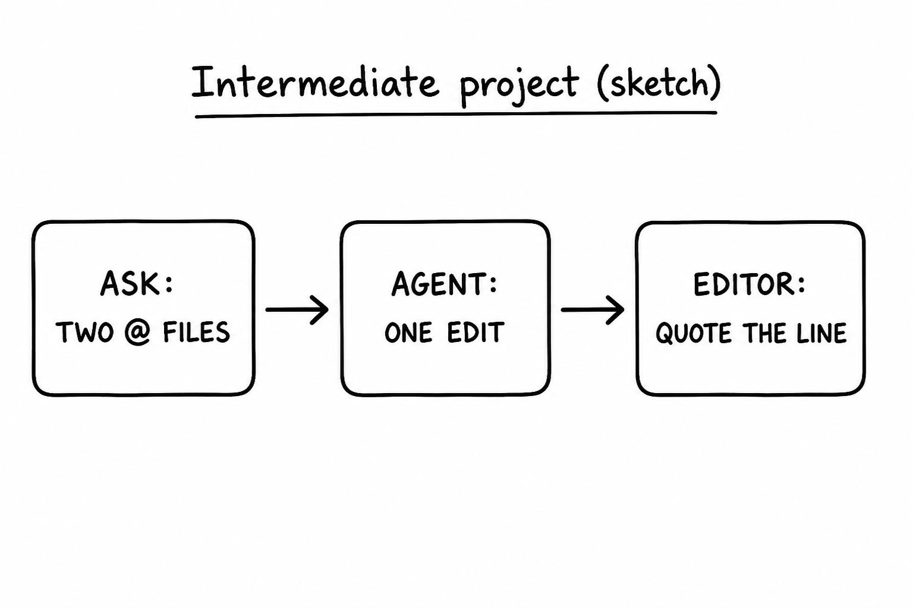
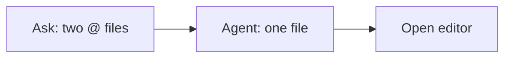

# Project (intermediate): Quiz, mix, small verified edit

## Learning objectives

By the end of this project you should be able to:

- Run a mixed quiz with **two** lesson files `@`’d
- Make one small Agent edit and quote the new line from the editor
- Keep Ask vs Agent split for quiz vs file ([lesson 06](lesson-06.md))

## Prerequisites

[Lessons 06–10](lesson-06.md).

## Key terms

- **Verified edit** — a file change you confirmed by opening the file, not by trusting chat
- Link back: [multi-file `@`](lesson-07.md), [mixed review](lesson-08.md), [small edit](lesson-09.md)

## Deliverable

(1) A mixed quiz across two earlier lessons, both files attached. (2) One small Agent edit — **one** practice question *or* **one** glossary row — that you confirm in the editor. Do not mark ✅ unless you studied.

## Explanation

### Steps

1. Pick two lessons you already have (example: [02](lesson-02.md) and [07](lesson-07.md)).
2. [Ask](lesson-02.md). `@` both files. `Give me a mixed quiz on these two lessons. Do not show answers until I try.` Three to five questions.
3. Switch to [Agent](lesson-02.md). `@` the **one** file you will change (`lesson-0X.md` **or** `index.md` for a glossary row).
4. Scope: `Add one practice question with a hidden details answer to lesson-0X of cursor. Do not create a new lesson file.` **or** `Add one glossary row for <term> from lesson-0X.`
5. Open that file in the editor. Find the new question or row. If it is not there, the edit did not land ([lesson 06](lesson-06.md)).

### Success

You can name the file that changed and quote the new line. Explorer has no surprise `lesson-16.md`.

## Media

- 🎥 Video: missing
- 🔊 Audio: missing
- 🖼️ Image: generated labeled diagram, not a Cursor screenshot

  

- 📊 Diagram:

## Worked example

1. Ask: `@lesson-02.md` `@lesson-06.md` — mixed questions on modes vs mixed intent.
2. Agent: `@lesson-05.md` — add one practice question about Ask vs Agent after a session (if 05 does not already have a near-duplicate).
3. Open `lesson-05.md`. Copy the new question number and first sentence. That quote is your proof.
4. Leave learning-path ✅ unchanged unless you studied those rows.

## Checklist

- [ ] Two lesson files were `@`’d for the mix
- [ ] Quiz was Ask; edit was Agent
- [ ] I opened the changed file and can quote the new line
- [ ] No extra lesson file appeared in Explorer
- [ ] I did not mark ✅ without study

## Practice questions

1. Why `@` two files for the mix?

Answer
So the quiz can use both lessons’ objectives, not only chat memory or one attachment ([lesson 07](lesson-07.md)).

2. What makes the edit “verified”?

Answer
You opened the file and saw the new text.

3. You wanted a glossary row but Agent rewrote lesson 01. What failed?

Answer
Scope / wrong `@`. Name `index.md` and “glossary row only.”

## Quick quiz

Ask the agent: `Quiz me on the intermediate Cursor project.`

## Summary

Mix with two `@`s in Ask. One bounded Agent edit. Proof is a line in the editor. Then advanced lesson 11.

## Next

→ [Lesson 11](lesson-11.md) (context, rules, and verifying the agent)
